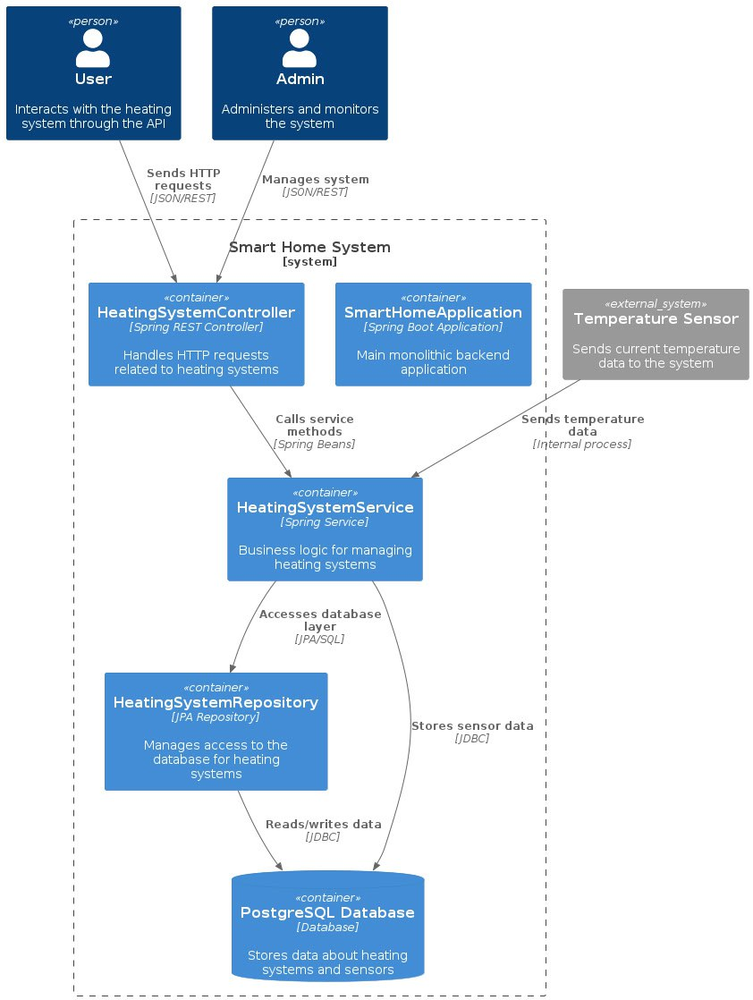
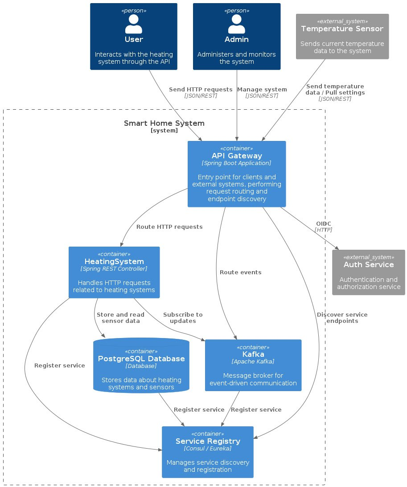
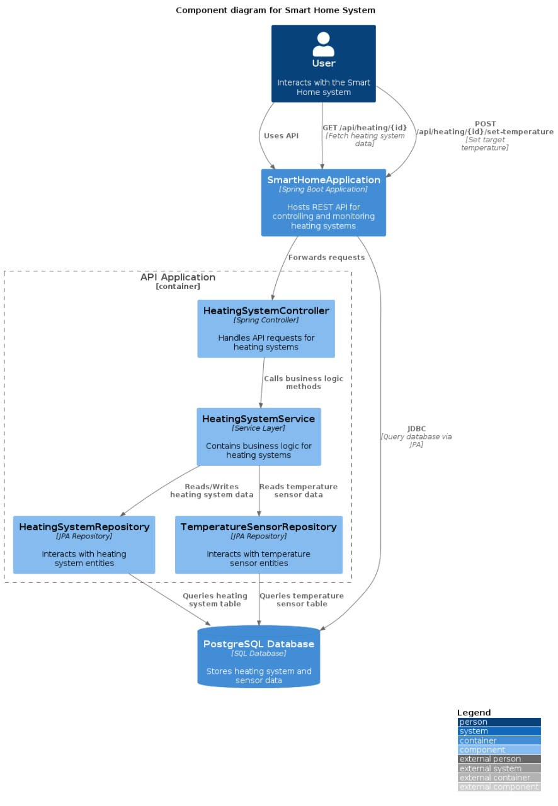
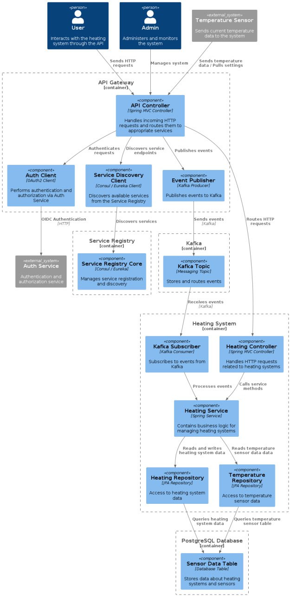
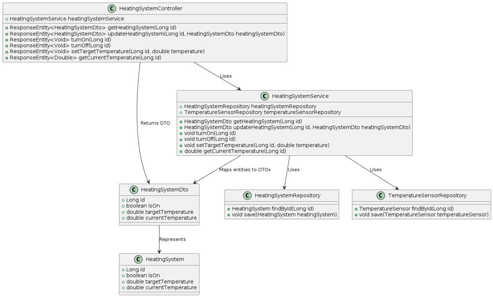
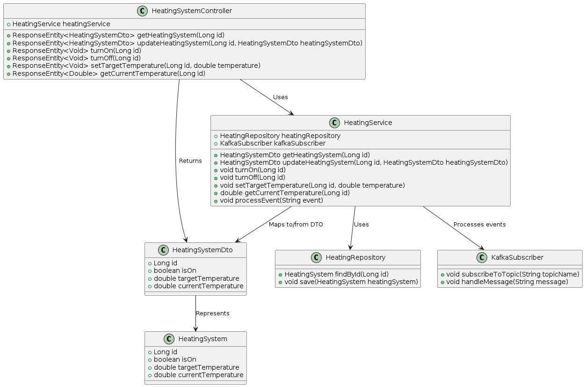
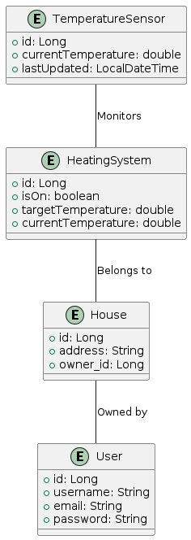
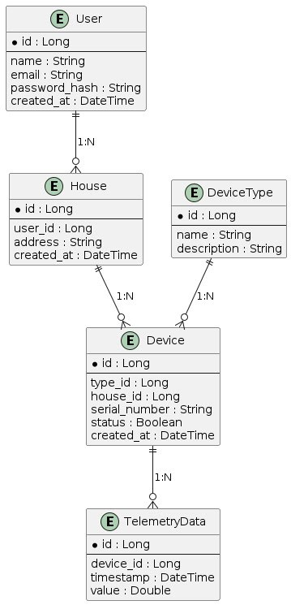

Это шаблон для решения **первой части** проектной работы. Структура этого файла повторяет структуру заданий. Заполняйте его по мере работы над решением.

# Задание 1. Анализ и планирование

Чтобы составить документ с описанием текущей архитектуры приложения, можно часть информации взять из описания компании условия задания. Это нормально.

### 1. Описание функциональности монолитного приложения

**Управление отоплением:**

- Пользователи могут удалённо включать/выключать отопление (нагреватели) в своих домах.
- Пользователи могут устанавливать желаемую температуру (нагревателя).
- Пользователь должен заранее знать ID своих нагревателей.

**Мониторинг температуры:**

- Пользователи могут просматривать текущую температуру в своих домах через веб-интерфейс.
- Система получает данные о температуре с датчиков, установленных в домах.
- Система получает данные о статусе нагревателей (вкл/выкл), установленных в домах.

### 2. Анализ архитектуры монолитного приложения

Перечислите здесь основные особенности текущего приложения: какой язык программирования используется, какая база данных, как организовано взаимодействие между компонентами и так далее.

Архитектура приложения представляет из себя монолит на Java с СУБД Postgres. Всё синхронно. Никаких асинхронных вызовов, микросервисов и реактивного взаимодействия в системе нет. Всё управление идёт от сервера к датчику. Данные о температуре также получаются через запрос от сервера к датчику.

Проект организован в соответствии со стандартной структурой Maven/Gradle проекта:

- **Основной класс приложения** аннотирован `@SpringBootApplication`.
- **Пакеты**:
    - `controller` - контроллеры для обработки HTTP-запросов.
    - `service` - сервисы для бизнес-логики.
    - `repository` - репозитории для доступа к базе данных.
    - `entity` - сущности JPA.
    - `dto` - объекты передачи данных (DTO).

Проект использует следующие зависимости:

- Java 17
- Maven >=3.8.1 && <4.0.0
- `spring-boot-starter-web` - для создания веб-приложений.
- `spring-boot-starter-data-jpa` - для работы с JPA и базой данных.
- `postgresql` - драйвер для работы с PostgreSQL.
- `springfox-boot-starter` - для интеграции Swagger.
- `lombok` - для упрощения написания кода.
- `spring-boot-starter-test`, `spring-boot-testcontainers`, `junit-jupiter`, `testcontainers` - для тестирования.

### 3. Определение доменов и границы контекстов

Опишите здесь домены, которые вы выделили.

- Один домен - домен управления устройствами

Контекст:
 - включение / выключение
 - изменение температуры
 - запрос статуса
 - мониторинг температуры

сущности: устройство;
объекты-значения: статус, температура;
агрегаты: группы устройств;
репозитории: репозиторий расписания;
сервисы: нет.

### **4. Проблемы монолитного решения**

Если рассматривать монолитное решение как самодостаточный сервис в единичном экземпляре, то возникают проблемы связанные с безопасностью и масштабированием, а именно:
 - пользователи, а так же данные пользователей не изолированы, что может привести к проблемам безопасности и влияния одно пользователя на другого
 - нет сервиса авторизации/аутентификации
 - ручное и трудозатратное масштабирование сервиса (по горизонтали и вертикали)
 - неоптимальное использование compute ресурсов - для данного сервиса подходит концепция Serverless (Function as a service)

Если вы считаете, что текущее решение не вызывает проблем, аргументируйте свою позицию.

### 5. Визуализация контекста системы — диаграмма С4

Добавьте сюда диаграмму контекста в модели C4.

[Диаграмма контекста](./diagrams/C4_context_asis.jpg)

# Задание 2. Проектирование микросервисной архитектуры

В этом задании вам нужно предоставить только диаграммы в модели C4. Мы не просим вас отдельно описывать получившиеся микросервисы и то, как вы определили взаимодействия между компонентами To-Be системы. Если вы правильно подготовите диаграммы C4, они и так это покажут.

**Диаграмма контейнеров (Containers)**

AS IS

TO BE

**Диаграмма компонентов (Components)**

AS IS

TO BE

**Диаграмма кода (Code)**

AS IS

TO BE

# Задание 3. Разработка ER-диаграммы

AS IS

TO BE

Основные сущности системы:

 - User: Пользователь системы.
 - House: Дом, подключённый к системе.
 - Device: Устройство, установленное в доме.
 - DeviceType: Тип устройства.
 - TelemetryData: Данные телеметрии, отправляемые устройствами.

Атрибуты

 - User:
    - id — уникальный идентификатор пользователя.
    - name — имя пользователя.
    - email — электронная почта пользователя.
    - password_hash — хэш пароля.
    - created_at — дата регистрации.

 - House:
    - id — уникальный идентификатор дома.
    - user_id — идентификатор пользователя (внешний ключ к User).
    - address — адрес дома.
    - created_at — дата добавления дома.

 - Device:
    -  id — уникальный идентификатор устройства.
    - type_id — идентификатор типа устройства (внешний ключ к DeviceType).
    - house_id — идентификатор дома (внешний ключ к House).
    - serial_number — серийный номер устройства.
    - status — состояние устройства (включено/выключено).
    - created_at — дата добавления устройства.

 - DeviceType:
    - id — уникальный идентификатор типа устройства.
    - name — название типа устройства (например, "Датчик температуры").
    - description — описание типа устройства.

 - TelemetryData:
    - id — уникальный идентификатор записи телеметрии.
    - device_id — идентификатор устройства (внешний ключ к Device).
    - timestamp — время отправки данных.
    - value — значение данных.

Описание связей между сущностями

- User ↔️ House:
    - Один пользователь может иметь несколько домов (1:N).
    - Каждый дом связан только с одним пользователем.

- House ↔️ Device:
    - Один дом может содержать несколько устройств (1:N).
    - Каждое устройство принадлежит только одному дому.

 - Device ↔️ DeviceType:
    - Один тип устройства может быть связан с несколькими устройствами (1:N).
    - Каждое устройство имеет один тип.

 - Device ↔️ TelemetryData:
     - Одно устройство может генерировать множество записей телеметрии (1:N).